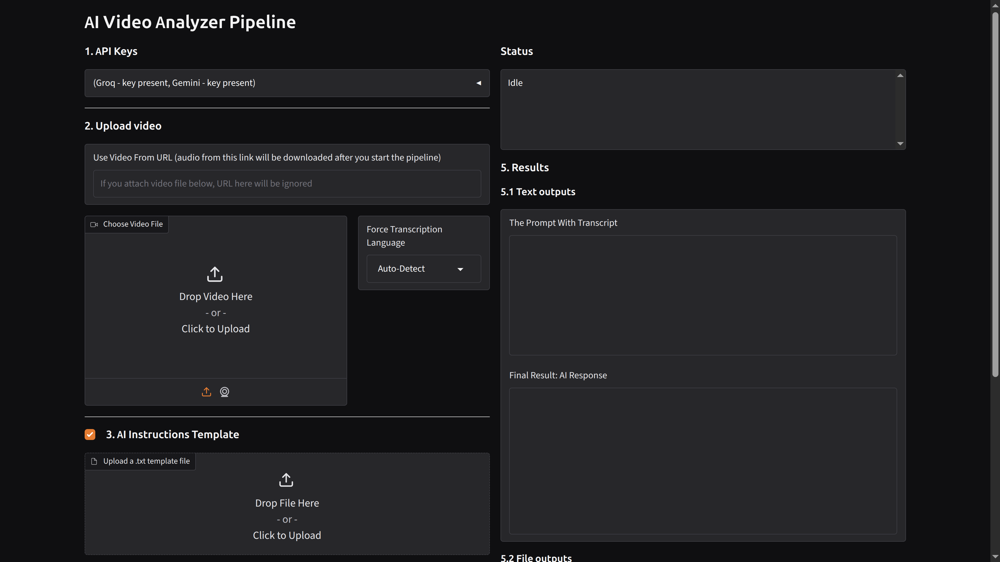

# Meet the greatest FREE video analyzer ever created - Transcriberio

A simple browser-based local automation utility to extract audio from video clips, transcribe it with blazing speed using Groq's cloud-hosted Whisper-large-v3, wrap it smoothly inside structural templates and run the output throught Gemini AI to get some tolerable analysis.



## Usage

### Features

- any length video support
  (I am sure 3-4 hours will be ok, maybe even much more, but I haven't tested; the daily limit for audio transcription is stated as 8 hours, but I haven't reached this limit; the 2 hour hourly limit is stated, but I exceeded this limit without consequences)
- URL support (not only local files, but link on any video, youtube etc. will do)
- several AI fallback options, so if the main model is unavailable, you still can get the AI output
  (max 20 video a day with gemini 3.5 flash model, 20 more with weaker 3.0 flash and 500 more with bare minimum model 3.1 flash light)
- on every run you get an .mp3 file of your audio, .txt of transcript and .md of AI output

### Troubleshooting

- Sometimes, videos from Youtube or Instagram won't download.
- Solution: You can try download several times. If it won't succeed, you can only then download them from some other tools, and use video there as a file.

## Installation

### Keys

#### Get the Groq API key

1. register on groq.com
2. go to API Keys section at the top menu,
3. create API key

- note: store it somewhere immediately, as Groq will not let you copy it again once you close the window

#### Get the Gemini (Google AI Studio) API key

1. register a Google account (if not already)
2. go to Google AI Studio and click "Get API key" in the bottom left corner
3. create API key

- note: you may not store it, as you can always copy it from here (at Groq you can't)

---

### Linux (Mint/Ubuntu)

#### Easy way

Go to Releases, download the archive for your system, extract files and double-click the Transcriberio file in Transcriberio folder.
Paste your keys in the app.
That's it.

To run the app next time, just run the Transcriberio

#### Hard way

1. Ensure your system has Python 3, FFmpeg and Git installed:

```bash
sudo apt update && sudo apt install python3 python3-venv ffmpeg git -y
```

2. Open your terminal in the folder where you want the project to live and run these commands:

```bash
git clone https://github.com/pastabi/transcriberio.git
cd transcriberio
chmod +x run.sh
./run.sh
```

It will automatically launch the dashboard in your browser.

3. Add the keys you got from Groq and Gemini to the app and you are all set.

To run the app next time, just run the ./run.sh in the command line, or doubleclick it.

---

### Windows

#### Easy way

Go to Releases, download the archive for your system, extract files and double-click the Transcriberio.exe file in Transcriberio folder.
Paste your keys in the app.
That's it.

To run the app next time, just run the Transcriberio.exe

#### Hard way

1. Ensure your system has Python 3, FFmpeg and Git installed:

```PowerShell
winget install Python.Python.3
winget install Gyan.FFmpeg
winget install Git.Git
```

If you have problems with winget, you can try to download python, ffmpeg and git from their websites, istall them and add to path.
Use AI if you have problems with that.

2. Open PowerShell in the folder where you want the project to live and run these commands:

```PowerShell
git clone https://github.com/pastabi/transcriberio.git
cd transcriberio
.\run.bat
```

It will automatically launch the dashboard in your browser.

3. Add the keys you got from Groq and Gemini to the app and you are all set.

To run the app next time, just run the .\run.bat in the command line, or doubleclick it.

---

## Plans

- [x] 1. Add longer videos support (over 1:40 hours)
- [x] 2. Add fallback models for AI analysis, so it works even if primary one is unavailable in the moment
- [x] 3. Add video support via link (video will be downloaded with yt-dlp)
- [x] 4. Create sufficient documentation and instructions
- [x] 5. Add option to choose the model for the users with a paid plan
